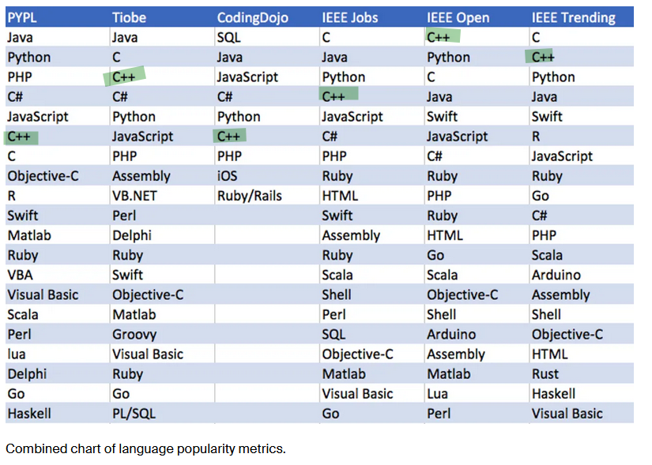
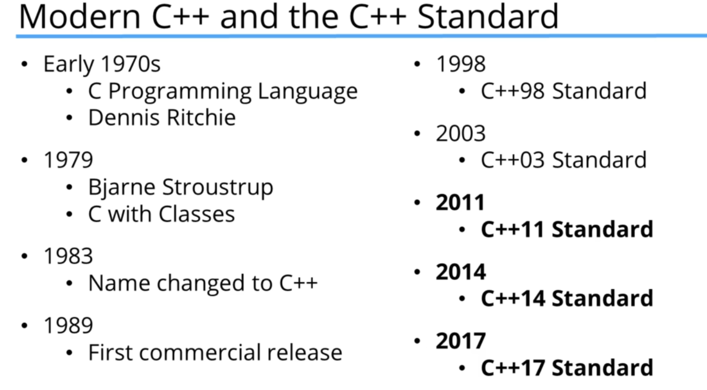
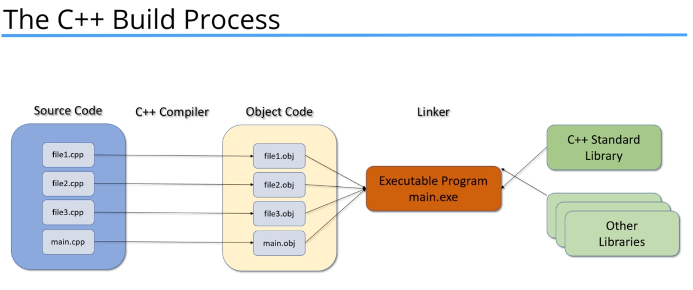

# Section 1 - Introduction

### C++ is very popular, and useful. it is consistently ranked high among popular programming languages:

there were many standards for the c++ language, but what we call "modern c++" started with c++11.

with c++20 and c++23 coming after this course was made.

### the build process
The programmer makes .cpp and .h files (amongst others), the compiler converts into .o (.obj) files, the linker takes these o files and other libraries and links them into the .exe file.

### Debugging
the debugger can then use this exe file in conjunction with the source code so show runtime of the code.

### The IDE
IDE help us use all these tools and more
There are many IDE's , im using visual studio code, but its only available on windows so beware..
