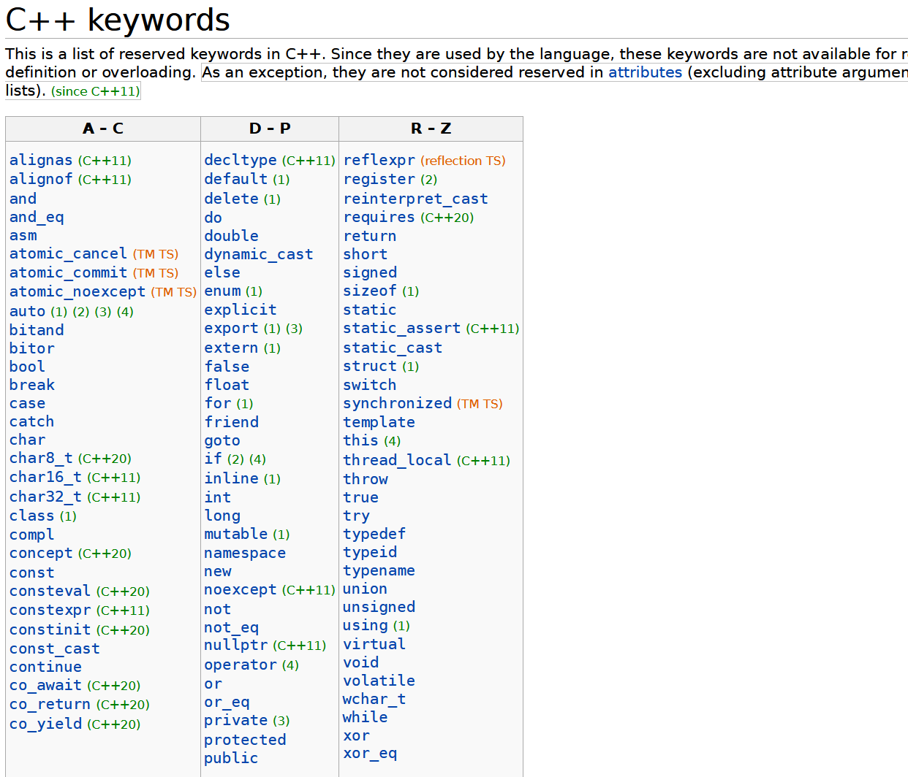
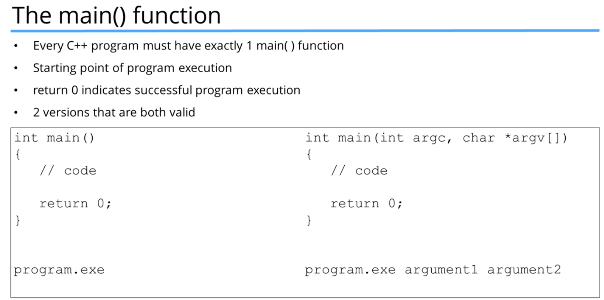
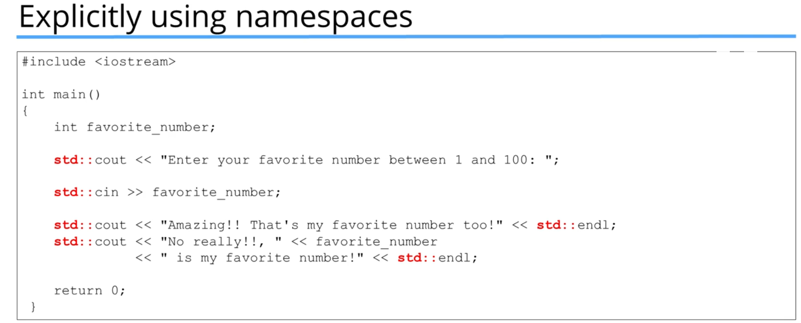
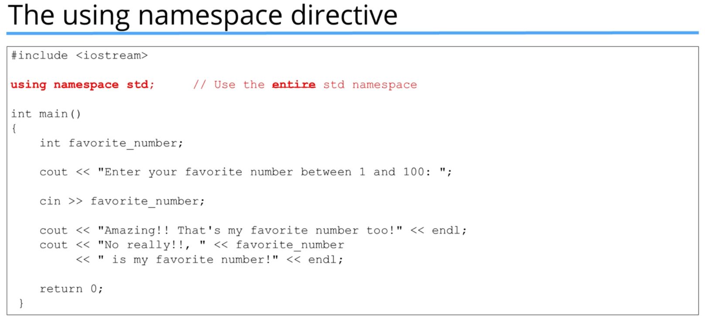
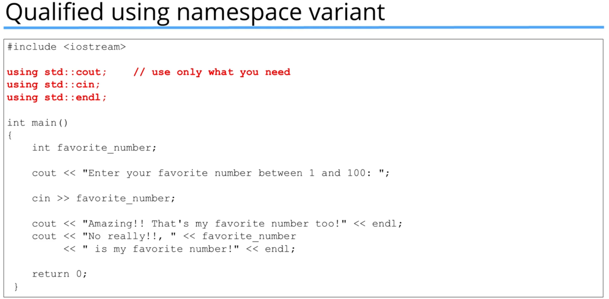
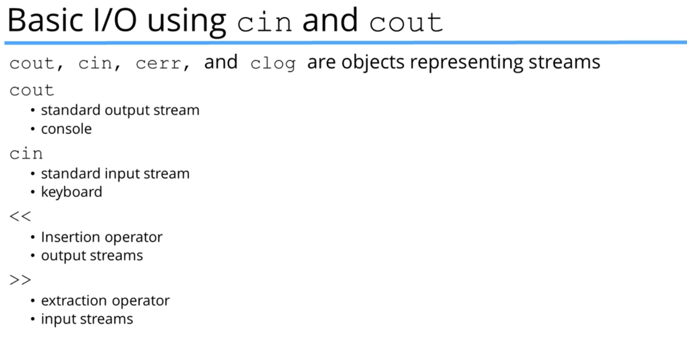
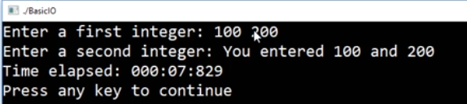
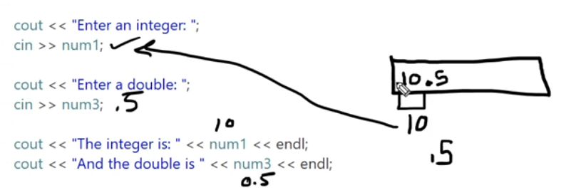
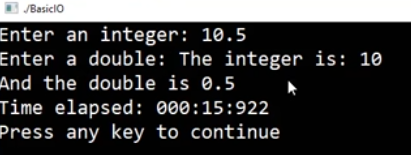
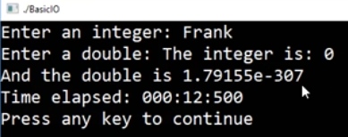

# Section 5 - Structure of a C++ Program
In this section we just get acquainted with some c++ basics.
These are the keywords of the language:


C++ has 90 keywords!
Java has 50, C has 32..
most programmers don't use a lot of these.<br>

## The preprocessor directives
for example ```#include``` or ```#ifndef```.
- the #include command replaces the name of the file with the contents of the file, and is very useful!

the c++ preprocessor doesn't understand c++, it just completes the command that has been defined for it

## Comments
explanations in the source code, this doesn't go to compiler at all, its just for the programmers.


```c++
// This is a single line comment

/* This is a multi
            line comment */

```
keep your commenting style consistent! don't keep useless or outdated comments


## The Main Function


- argc is the number of arguments
- argv[] is an array of the arguments (strings)

## Coding Standards and Best Practices
programmers have certain standards so that code is readable and less error prone
you can read a bunch here
https://isocpp.org/

also, in VSCode use format document, or ```SHIFT+ALT+F``` to format it better. this uses the default c++ formatter, but i can install a different extension if i want for different languages.

## Namespaces
sooner or later, we will come across a situation that we use a library or someones code that named something the same as our code.
that is why there are namespaces.

namespace is a scope of code.
so for example std is a namespace in the standard library (std), and to use their function cout, i need to use std::cout. or alternatively use ```using namespace std``` but then be careful about using the same function names as stuff in std.




but this is bad since std has a bunch of stuff that may cause conflict, so we can also use the Qualified using namespace variant:



## Basic IOStream

so for example
```c++
cout << data << moreData << endl;
cin >> variable;
```
- cout does not automatically add line breaks, so we can add \n or endl at the end.
```endl``` also flushes the stream.
- cin can fail if the entered data cannot be interpreted
- cin uses whitespace to differentiate different values, so if u input 1 2, only the first 1 will be read to the variable here, and we must read the second 2 again to some variable.

these <<, >> operators can also be used for file streams.
<br>
now, if there is already data in the cin buffer, it will not wait for the user to input.
for example
if i have code:
```C++
cout << "enter num1";
cin >> num1;
cout << "enter num2';
cin >> num2;
```
if my input is 
```shell
100 200
```
then it will just go to then, wont wait for num2, num2 will be 200 automatically





we can also chain the cin:
```c++
cin >> num1 >> num2; 
```

### Additional Notes
now, the cin will read an integer until its end, then end can be a dot though
so we might face an issue like this:



also, it might attempt to read an integer something that isn't an integer, which can cause some undefined behavior.


