# Section 6 - Variables
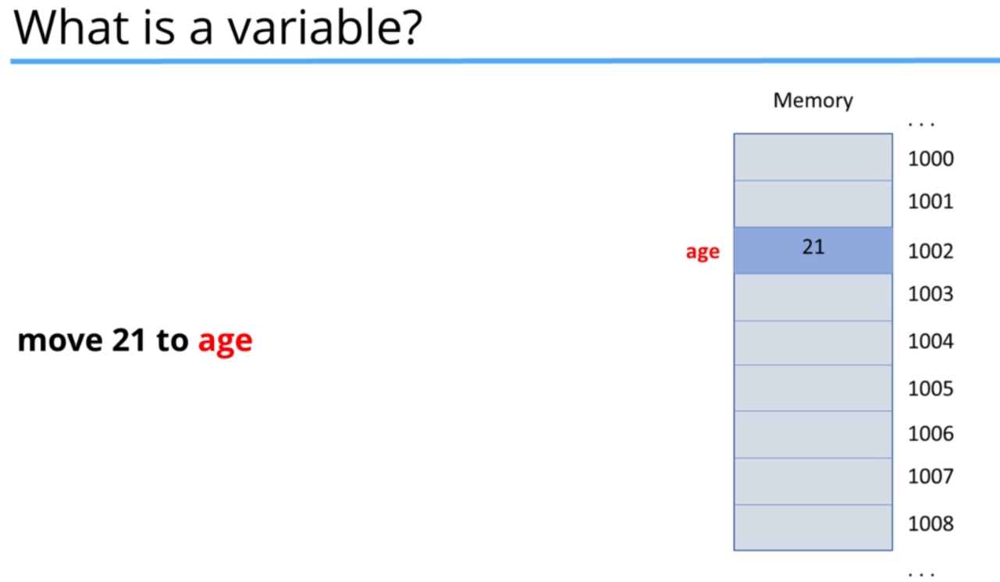
It's basically a location in memory (RAM), we give a name to so that we dont need to specify the address.
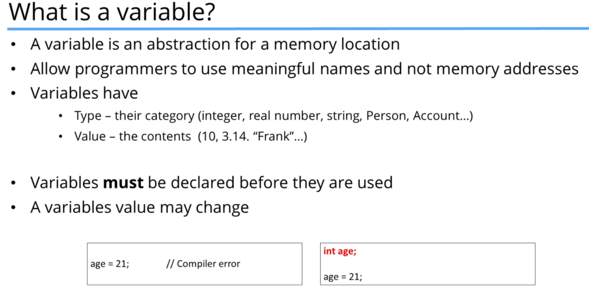

## Declaring Variables and Initializing 

To declare a variable, the syntax is ```VariableType VariableName;```
```c++
//builtin types
int num;
bool yes_or_no;
char letter;
string str;

// our own declared types
Account franks_Acc;
```

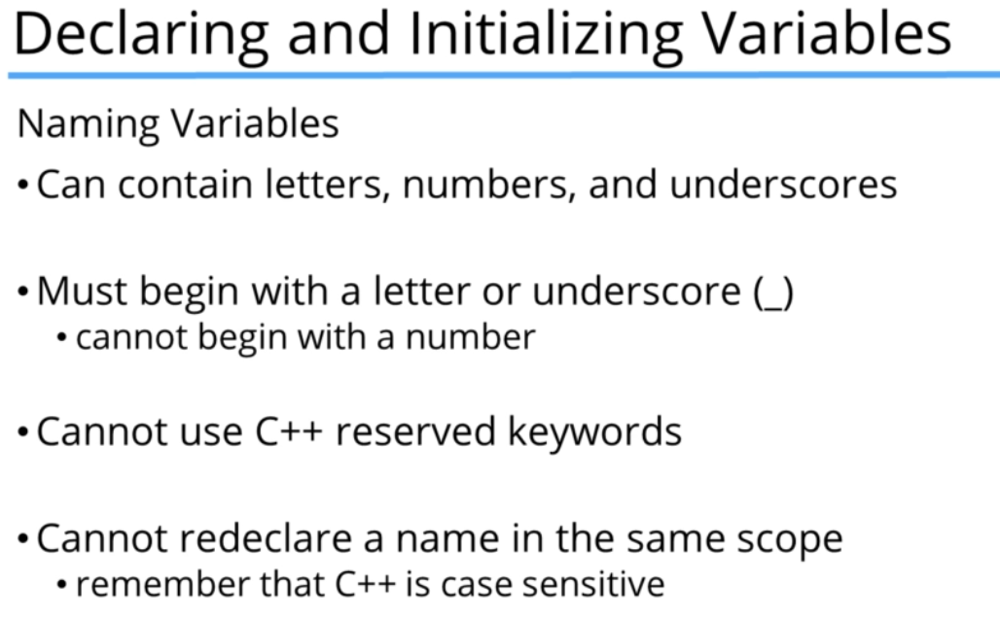

these are the laws, but its important to have a consistent style:
- camelCase or under_score_names, not both
- don't begin names with _, this is reserved for certain special variables
- not too long/short/noMeaning
- never use a variable before init, because it has some garbage data
- don't use obscure abbreviations
- declare variables right before you use them

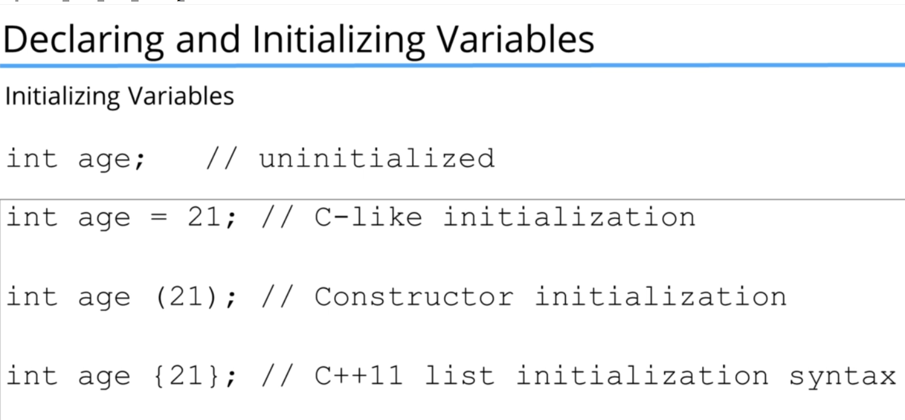

the instructor encourages the int age {21} style, because it is consistent in c++11 and onwards

The variables are accessible within the *scope* of their declaration { }
if we want them to be accessible from anywhere, we use *global* variables, which are automatically initialized with 0.

### shadowing
sometimes we declare the same variable name in the **inner** scope, and it Replaces the global one _within_ this scope:
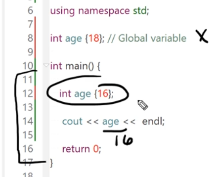


## Types
Variables have a data type, with specific sizes and uses.
```# include <climts>``` has all the specific compiler-dependent sizes of these variables.
- character types
- integer types
- float types
- boolean types

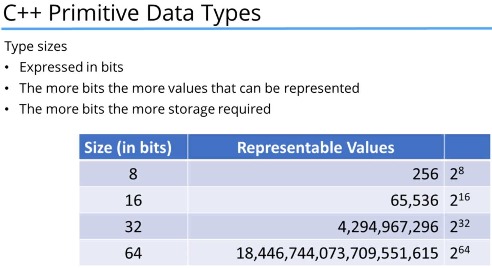

### Character types
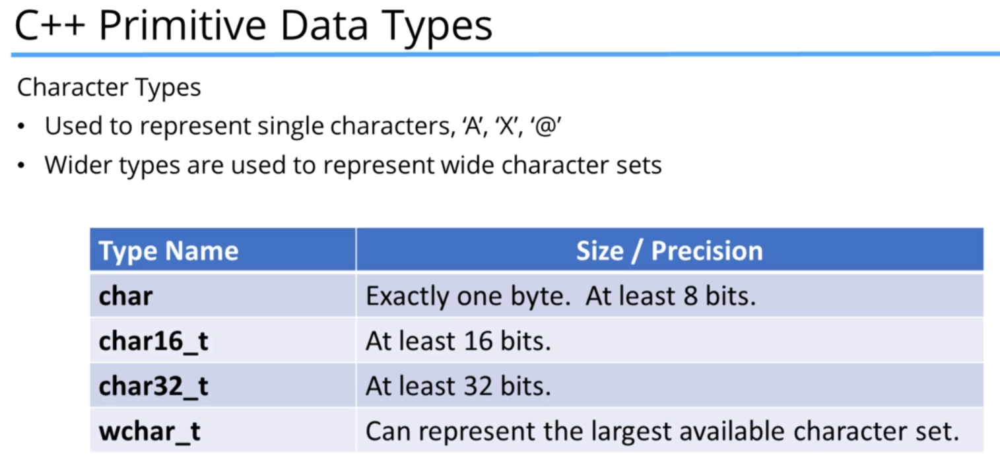

declaring them in c++ goes like this:
``` char someLetter {'J'} ``` , 
note the use of ' tick marks  , **DO NOT** use "" as you do for strings.


### Integer types

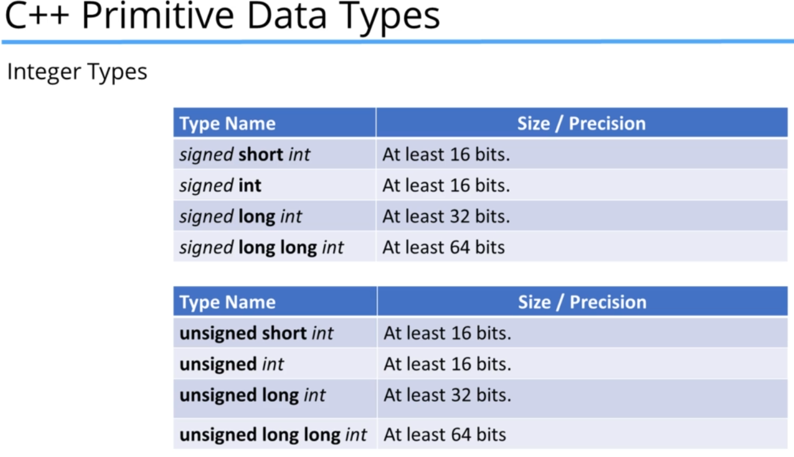
The bold is the name of the type in c++:

the C++14 standard allows the use of tick marks inside a number for readability

```c++
long long people_on_earth {7'600'000'000};
```

### Floating point types

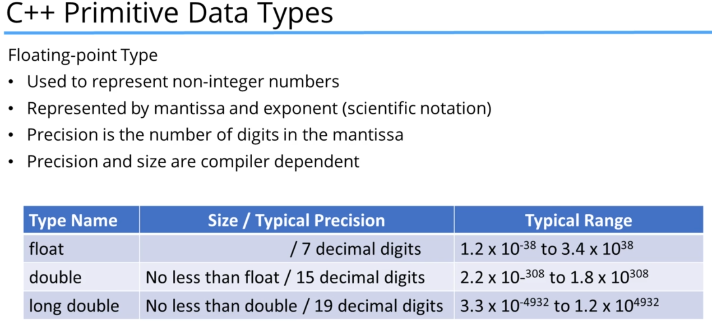

You can also write the scientific notation for large numbers:
```c++
long double large_amount {2.7e120}
```

### Boolean type

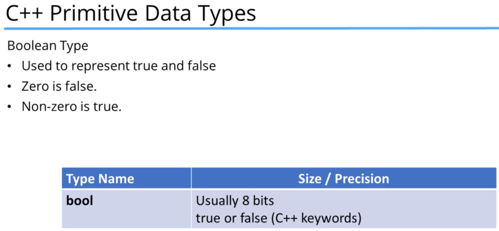

```c++
bool game_over{false}
```
as far as c++ is concerned, false is 0 , true is 1, and any other int is also true.


## The sizeof operator
determines the size in bytes of a type or variable

examples:
```c++
sizeof(int);
sizeof(double);

sizeof(someVariable);
sizeof someVariable;
```

this info comes from ```<climts>``` and ```<cfloats>>```.<br>
you don't have to include them to use sizeof.<br>
these libraries also have the Maximum and Minimum values of the types

- CHAR_MIN and CHAR_MAX
- INT_MIN
- SHRT_MIN
- LONG_MIN
- LLONG_MIN

and others


## Constants

Like c++ variables, but their value cannot be changed once declared!
we use them to not use "magic numbers" throughout the code, instead saving the important values somewhere constant in the code.

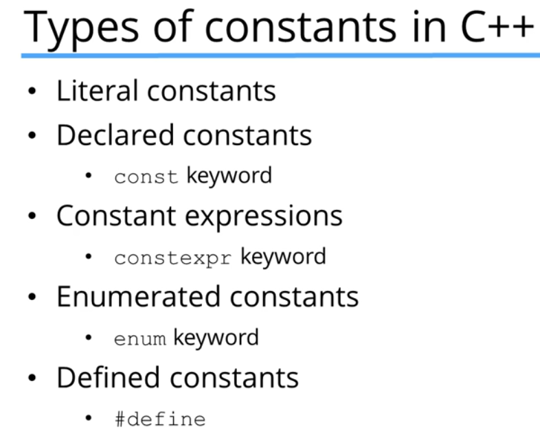

### literals
```c++
x = 12;
y = 1.56;
name = "Frank";
```
you can be specific with the types of literals:
```c++
12;
12U; // unsigned integer
12L; // a long integer
12LL; // long long

12.1; //a Double
12.1F; // a Float
12.1L; //a long double
```
There are also character literal constants

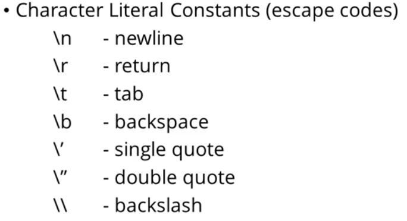

#### Declared constants
declared using ```const``` keyword:
```c++
const double pi {3.1415926};
const int monthsInYear {12};
pi = 3; //compiler ERROR!
```

#### Defined constants:
do not use this! this is a preprocessor directive, simple find-and-replaces anywhere one is written with another. This can generate hidden errors!

```
#define pi 3.1415926
```