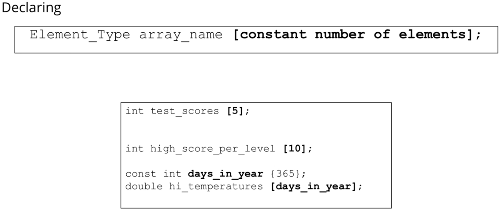
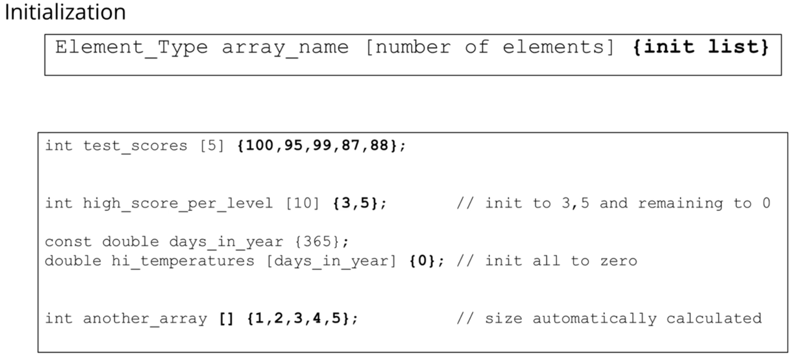
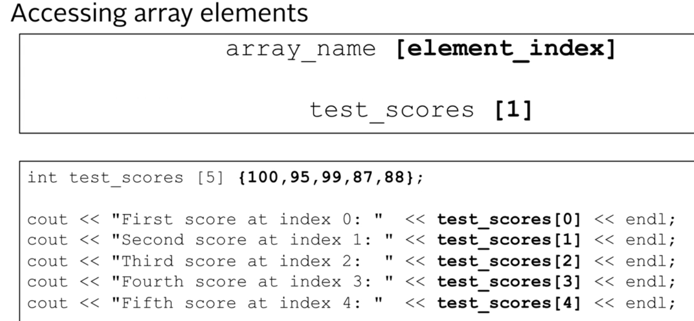
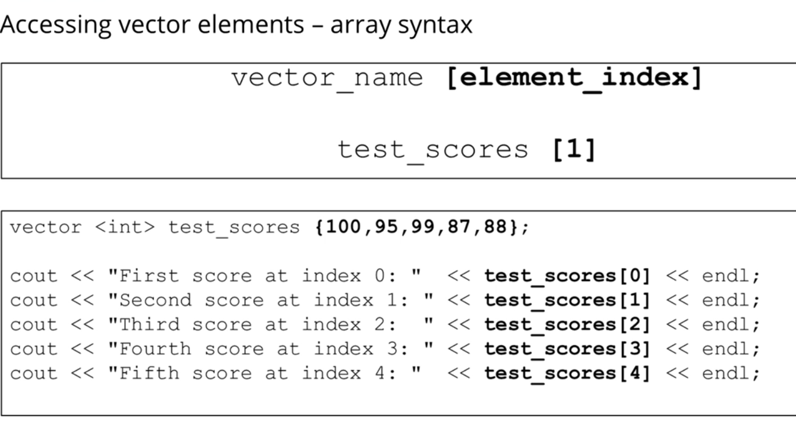
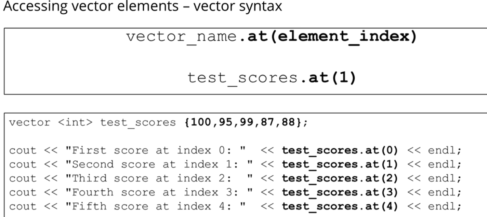
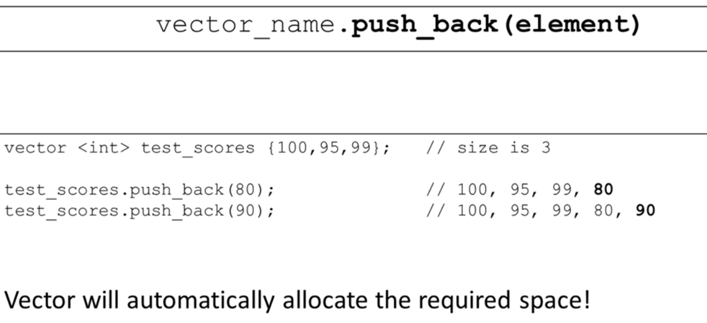

# Section 7 - Arrays and Vectors

The instructor says arrays are worse than vectors, 
but its important to understand them for legacy c++ code.

## Arrays
Compound data types - made up of other data types. its a list of integers for example.
instead of
```score1, score2,score3 ... ``` we use an array of scores[].

- Array size is **fixed**
- elements are all of the **same type**
- first element is at index 0
- last is at **size-1**
- there is **no checking** to see if you are out of bounds. you might accidentally access data out of bounds
- array memory is allocated as **one chunk** in memory, its very efficient to access it.
- it is recommended to initialize every element of an array when it is declared.

### Declaring arrays


**We cannot use non constant variables to declare an array size!**
```c++
int a;
cin >> a;
int b[a]; // THIS IS INVALID because a is a variable whose value is determined at runtime.
```

in C++, the size of an array must be a compile-time constant, known at the time of compilation. Using a variable to determine the size of an array is not permitted in standard C++.<br>for variable length arrays, we might use ```std::vector``` instead.

We can also initialize arrays when we declare them:



### Accessing and modifying arrays


changing the contents of the array elements is the same. ``` arr[0] = 5``` for example.

How does this work? the name of an array represents the location of the first element in the array (a pointer), and arr[4] simply adds 4 (```*sizeof(arr[0])```) to that location to calculate the offset from the beginning of the array to find the correct elements. 

So in the following code:
```c++
int testScores[] {1,2,3,4,5};
cout << test_scores <<endl;
```
will give me the address of the array - a pointer! for example ```0x61fee4``` <br> 
test_score[0] gives the first element.


### Multi dimensional arrays
```c++
// Declaration
Element_Type array_name [dim1_size] [dim2_size];
int movie_rating [3][4];
```
its a matrix with rows and cols.
```c++
const int rows {3};
const int cols {4};
int movie_rating [rows][cols] 
{
    {0,4,3,5},
    {2,3,3,5},
    {1,4,4,5}
};

//access:
cout << movie_rating[1][2]; //gives row 2 column 3.

//initializing all to zero (c++11)
int arr[rows][cols] = {}; // Initializes all elements to zero
```


## Vectors
This is a dynamic array - not fixed in size.
This data type is part of the **C++ Standard Template Library**, or **STL**.
- provides similar semantics and syntax as arrays
- very efficient
- can provide bounds checking
- can use lots of cool functions like sort, reverse, find and more

The array container is in ```<vector>``` library
### Declaring Vectors

```c++
#include <vector>

//no size
std::vector<char> vowels;
std::vector<int> test_scores;

//sized vectors. all integers are automatically initialized to zero.
std::vector<char> vowels (5);
std::vector<int> test_scores (10);

// initialized:
// 5 values in the vector
std::vector <char> vowels {'a','e','i','o','u'};

// 365 sized vector, all initialized to 80.0
std::vector <double> hi_temps (365,  80.0)

```

### Accessing individual vector elements
#### Same as arrays:<br>
**No bounds checking for vectors when accessed like this**



#### Or as an object with .at method.



### Dynamic sizing:

We can push into the end of the vector with a method ```.push_back(element)``` on the vector.


we can get the vector size with the method ```.size()```

### 2D Vectors:

It's a vector of vectors.
```c++
using std::vector;

vector <vector<int>> movie_ratings
{
    {1,2,3,4},
    {1,2,4,4},
    {1,3,4,5}
};
```

and we can access it with ```movie_ratings[0][1]``` or ```movie_ratings.at(0).at(1)```