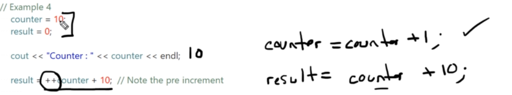
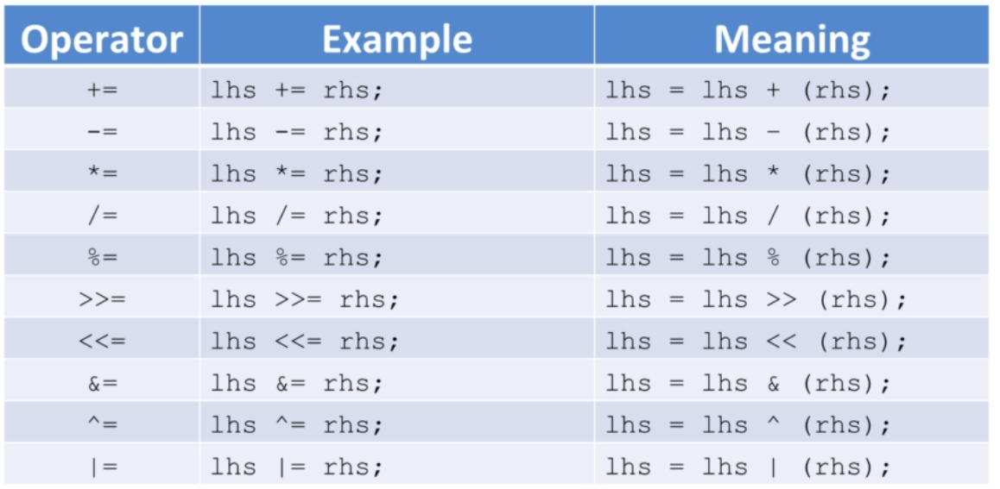

# Section 8 - Statements and Operators


## Expressions
A sequence of operators and operands that specifies a computation
for example:

- 34
- favorite_number
- 1.5+2.8
- a>b

## Statement
A complete line of code that performs some action.
for example
- int x;
- favorite_number = 12;
- 1.5 + 2.8; (useless statement)
- if (a>b) cout << "a is greater than b";
- ;   // Null statement.

## operators
- unary operators like \- that need only one operand
- binary operators , the most common ones like + - * /
- trinary operators, like ?

### Assignment operator
```lhs = rhs```
rhs is an expression that is evaluated to a value.

the value in rhs is stored to the lhs. <br>
the assignment expression **returns the the value that was assigned**, so (a = 50) returns 50
so ```cout << (a = 50);``` will print 50 and assign 50 to a.
```c++
// initialization
int num1{10};
int num2{20}; 
num1 = 100; //assignment statement

num1 = num2 = 1000; // num2 is assigned 1000, then num1 is assigned 1000;
```

### Math operators
- \+ addition
- \- subtraction
- \* multiplication

- \\ division with integers ```10/3``` gives only the whole number (not 3.333), so 3
- % modulo division, returns the remainder ```10/3``` gives 1


    - If one operand is double, the other will be converted to double.

### Increment and Decrement
++ or --
- Prefix ```++num```  increments num and returns num+1 
- Postfix ```num++``` returns num and increments num (num=num+1)

Never use it twice for the same variable in the same statement (undefined!) ```num++++```



## Casting (Explicit) and type Coercion (implicit by the compiler)
 in C++, you can use arithmetic operators with different numeric types, such as shorts, longs, floats, and doubles. When you perform arithmetic operations on these different types, the operands are subject to implicit conversions to a common type based on certain rules defined by C++.

- Integral Promotions: Smaller integral types (like shorts) are promoted to int before arithmetic operations.
- Usual Arithmetic Conversions: When different types are involved, C++ uses a set of rules to promote operands to a common type:
    - If one operand is float, the other will be converted to float.

```2 * 5.2 ``` 2 is promoted to 2.0
```int num; num == 100.2``` 100.2 is demoted to 100

### Casting:
```c++
double avg{0.00};
avg = static_cast<double>(100) / 8; // cast 100 (an integer) to 100.0 (double) so that the calculation will work correctly (not integer division)
```

This is the modern c++ casting syntax, which is recommended.<br>
there is also the C-style cast you are familiar with, (double)100. <br>
C++ style casts are checked by the compiler. C style casts aren't and can fail at runtime!


## Boolean operators

the == and != operators test for inequality and evaluate to True or False, 1 or 0. <br>
the < and > and =< and => operators are comparison, also evaluate to True or False.

if you want to display ```true``` or ```false``` to the output stream instead of 1 or 0,<br>
use ```cout << std::boolalpha``` and ```cout << std::noboolalpha``` to cancel it.

there is also a threeway comparison for c++20 - ```<=>``` <br>
In C++, the "spaceship operator," is typically used for ordering.

The possible outputs of the spaceship operator (<=>) include:
```c++
    //Returns Negative Value (-1): If the left operand is less than the right operand.
    int result = 5 <=> 10; // result will be -1
    //Returns Zero (0): If the left operand is equal to the right operand.
    int result = 10 <=> 10; // result will be 0
    //Returns Positive Value (1): If the left operand is greater than the right operand.
    int result = 15 <=> 10; // result will be 1
```

there are also Logical operators
- ```not``` or ```!```
- ```and``` or ```&&```
- ```or``` or ```||```

### Short-Circuit behavior
when evaluating a logical expression c++ stops as soon as the result is known
- ```a && b && c```
  - if a is false it stops right there, doesn't evaluate the rest.
- ```a || b || c```
  - if a is true it stops right there, doesn't evaluate the rest.


## Compound Assignment
