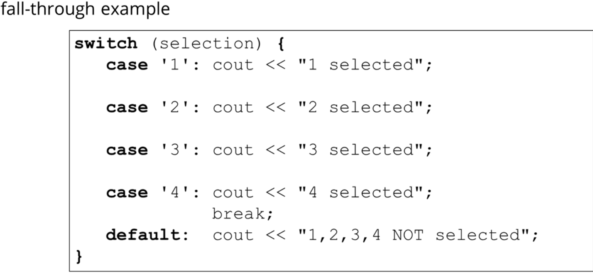

# Section 8 - Statements and Operators
- Sequence - execute code sequentially, line by line.
- Selection - make decisions during code about which code to execute: if/else/switch/?:
- Iteration - Looping or repeating - for/while/do-while/continue/break.

## if statement
```statement``` is executed if ```expr``` is evaluated to true:<br>
reminder - whitespace is irrelevant to the code.

```c++
// single statement
if (expr)
  statement;

// multiple statements:
if (expr)
{
  statement1;
  statement2;
  ...
}
```
#### if-else
specifies what to execute when ```expr``` is evaluated to false
```c++
if (expr)
{
  doIfYes;
}
else
{
  doIfNo;
}
```

assuming we have nested if statements:
```c++
if (expr1)
  if (expr2)
    lel;
  else
    lel2;
```
the else belongs to the closest if in c++.

### Block statement


## switch
a fancy if-else-if-else for an enumerated type, like int.

- integer_control_expr must be an integer or enumerated.
- expression_1 and the others **must be known at compile time**, so constants or literals
- break; statement gets out of the code block.
  - if there was no break statement it goes straight to the next code in the block, without checking the cases again:
  - 
  - don't do this like that because it's confusing! use break; at every case.
- default statement gets executed if no other case was used.
- we can have different cases execute the same code like this:


## enum

```c++
// declare new type called Color
enum Color {
    RED,
    GREEN,
    BLUE
};

// it can be one of the choices we declared. 
Color heading{red};
```
By default, these constants are assigned integral values starting from 0 (RED is 0, GREEN is 1, BLUE is 2). You can explicitly assign values to enum constants as well:
```c++
enum Status {
    OK = 0,
    ERROR = -1,
    PENDING = 1
};
```

Enums can be used to declare variables, and the enum constants can be accessed using the enum type:
```c++
Color selectedColor = RED;
Status currentStatus = ERROR;

if (selectedColor == GREEN) {
    // Do something for green color
}

switch (currentStatus) {
    case OK:
        // Handle OK status
        break;
    case ERROR:
        // Handle ERROR status
        break;
    case PENDING:
        // Handle PENDING status
        break;
}
```

Starting from C++11, you can specify the underlying type for an enum (must be integral type like int or short or long..):

```c++
enum class Weekday : int {
    MONDAY,
    TUESDAY,
    WEDNESDAY
};
```

C++11 introduced "enum class," which brings more robust scoping and prevents unwanted implicit conversions:

```c++
enum class Fruit {
    APPLE,
    ORANGE,
    BANANA
};

//we cant just use APPLE, APPLE is scoped under the enum class, so we use Fruit::APPLE
Fruit myFruit = Fruit::APPLE;
```

## The ternary conditional operator


# Iteration - Looping

## for loop
when you want to loop n times, it has a special section for declaring variables and (typically) incrementing them, as well as checking some kind of condition that terminates the loop.
when conditional is false we break from the loop, else we continue.

```c++
for (initialization; conditional; statements)
{
  statements;
}
```
example:
```c++

for(int i{0}; i<5 ; i++)
{
  cout << i <<endl;
}
```
all things here are optional.
```c++
//this is legal - infinite loop
for (;;) {
    // Code here
}
```


### range-based for loop
loop through each variable in a sequence - which can be an array, vector, collection, whatever.

```c++
for (var_type var : sequence)
{
  statements;
}
```
so for example:
```c++
int scores[] {100,90,97};
for (int score : scores)
  cout << score << endl;
```

we can even iterate over a string:
```c++
for (auto c: "Frank")
  cout << c << " "; //will give F r a n k
```

#### The auto keyword
We don't even need to give a type sometimes, we just tell the compiler to deduce the type itself:
```c++
int scores[] {100,90,97};
for (auto score : scores)
  cout << score << endl;
```

## The While loop
```c++
while (expression)
  statement;
```

if expression == true then statement is executed, and then we loop back to the check.

### do-while
```c++
do
{
  statement;
} while(expression);

```
with the do, we don't check the expression until after the first run.


## break and continue
they are only used in loops and switches.
break exits, continue continues the loop from the beginning (not including the initialization) and tries the conditional again